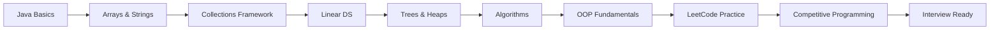

# ☕ Java Data Structures, Algorithms & LeetCode Journey

<div align="center">
  
  
  
  
  
  
</div>

<br/>

<div align="center">
  <sub>A structured, clean learning repository covering <b>Java fundamentals → Data Structures → Algorithms → OOP → LeetCode → Competitive Programming</b></sub>
</div>

---

## 🚀 About This Repository

This repository represents a **structured learning journey** through Java programming, designed to build a strong foundation in computer science and prepare for technical interviews. Every concept is implemented from scratch with detailed comments and complexity analysis.

Each file is standalone, runnable, and includes edge-case handling and complexity explanations, making it a reliable reference for learning and review.

---

## 🎯 Recruiter Snapshot

<div align="center">
  <table>
    <tr>
      <td><b>💻 Core Language</b></td>
      <td>Java 17 (Modern Features, Streams, Lambdas)</td>
      <td><b>🧠 Paradigms</b></td>
      <td>OOP Pillars, Custom Exceptions, Clean Code</td>
    </tr>
    <tr>
      <td><b>📂 Data Structures</b></td>
      <td>Linked Lists, Stacks, Queues, Heaps, BSTs</td>
      <td><b>🔍 Algorithmic Patterns</b></td>
      <td>Sliding Window, Two-Pointers, Binary Search</td>
    </tr>
    <tr>
      <td><b>🚀 Target Goals</b></td>
      <td>65+ LeetCode Solutions, Competitive Contests</td>
      <td><b>💼 Highlight Project</b></td>
      <td>File-Persistent Console Banking System</td>
    </tr>
  </table>
</div>

---

## ⚡ Quick Start

Get the project up and running in less than 10 seconds:

```bash
# 1. Clone the repository
git clone https://github.com/garvit-mishra-beep/JAVA.git
cd JAVA

# 2. Run a Java file directly (requires Java 11+)
java JavaBasics/PrimeVerification.java
```

### Traditional Compilation & Run
```bash
# Compile
javac JavaBasics/PrimeVerification.java

# Run (Prime class is generated in JavaBasics folder)
java -cp JavaBasics Prime
```

## 📊 Repository Statistics

<div align="center">
  <table>
    <thead>
      <tr>
        <th>Metric Category</th>
        <th>Completed Range</th>
        <th>Progress Visualizer</th>
      </tr>
    </thead>
    <tbody>
      <tr>
        <td><b>Total Java Files</b></td>
        <td><code>160+</code></td>
        <td><code>████████████</code> <i>(Complete Coverage)</i></td>
      </tr>
      <tr>
        <td><b>LeetCode Solutions</b></td>
        <td><code>65+</code></td>
        <td><code>████████░░░░</code> <i>(Target: 100 Problems)</i></td>
      </tr>
      <tr>
        <td><b>DSA Implementations</b></td>
        <td><code>55+</code></td>
        <td><code>█████████░░░</code> <i>(Target: 70 Concepts)</i></td>
      </tr>
      <tr>
        <td><b>OOP Examples</b></td>
        <td><code>25+</code></td>
        <td><code>████████████</code> <i>(Completed)</i></td>
      </tr>
      <tr>
        <td><b>Contest Solutions</b></td>
        <td><code>5+</code></td>
        <td><code>████░░░░░░░░</code> <i>(Continuous Practice)</i></td>
      </tr>
      <tr>
        <td><b>Java Basics</b></td>
        <td><code>15+</code></td>
        <td><code>████████████</code> <i>(Completed)</i></td>
      </tr>
    </tbody>
  </table>
</div>

---

## 🗺️ Structured Learning Roadmap



### 📖 Detailed Progression:

1. **☕ Java Basics** — Syntax, loops, conditionals, basic inputs, and operators.
2. **📦 Arrays & Strings** — Prefix sums, two-pointer techniques, palindromes, and substring manipulation.
3. **🗃️ Collections Framework** — Standard usage of `ArrayList`, `LinkedList`, `HashMap`, `HashSet`, and custom classes.
4. **🔗 Linear Data Structures** — Manual implementations of linked lists, stacks, and queues.
5. **🌳 Hierarchical Data Structures** — Binary trees, BSTs, traversals, and min/max heap operations.
6. **🔄 Algorithms** — Binary search, classic sorting (Bubble, Merge, Quick), and recursion.
7. **🧠 OOP Fundamentals** — Encapsulation, inheritance, polymorphism, and abstraction.
8. **🟡 LeetCode & Contests** — 65+ questions sorted by patterns, plus optimized contest solutions.

---

## 📂 Repository Structure

```text
JAVA/
├── 📂 Arrays/          → 15+ files - Array manipulation techniques
├── 📂 Collections/     → 5+ files - Java Collections Framework
├── 📂 Contests/        → 5+ files - Competitive programming solutions
├── 📂 Hashmap/         → Specialized HashMap implementations
├── 📂 Heap/            → Heap and priority queue implementations
├── 📂 JavaBasics/      → 15+ files - Core Java fundamentals
├── 📂 Linkedlist/      → 5+ files - Manual linked list implementation
├── 📂 OOP/             → 25+ files - Object-oriented programming principles
│   ├── 📂 Abstraction/
│   ├── 📂 Encapsulation/
│   ├── 📂 Inheritance/
│   └── 📂 Polymorphism/
├── 📂 PBL/             → Project-Based Learning: Banking System
├── 📂 Queue/           → Queue implementations
├── 📂 Recursion/       → 5+ files - Recursive algorithms
├── 📂 Searching/       → Linear & binary search
├── 📂 Sorting/         → 5+ files - Classic sorting algorithms
├── 📂 Stack/           → Stack operations
└── 📂 leetcode/        → 65+ files - LeetCode problem solutions
```

---

## 🏆 LeetCode Pattern Coverage

Focusing on pattern recognition is key to solving unseen technical interview questions:

| Pattern | Target Level | Key Focus Area |
|:---|:---:|:---|
| **Arrays & Hashing** |  | HashMaps, frequency counting, prefix sums |
| **Two Pointers** |  | Left-right pointers, sliding window variations |
| **Sliding Window** |  | Variable/fixed-size windows, substring operations |
| **Binary Search** |  | Target search, rotated search, answer-space optimization |
| **Stack & Queue** |  | Parentheses validation, expression evaluation |
| **Linked List** |  | Cycle detection, list reversal, merging |
| **Trees & Heaps** |  | Traversals, BST validation, Kth largest element |
| **Recursion & Backtracking** |  | Subsets, permutations, combination sum |

---

## ⚡ DSA Complexity Cheat Sheet

| Data Structure | Access | Search | Insert | Delete | Space |
|:---|:---:|:---:|:---:|:---:|:---:|
| **Array** | $O(1)$ | $O(n)$ | $O(n)$ | $O(n)$ | $O(n)$ |
| **Linked List** | $O(n)$ | $O(n)$ | $O(1)$ | $O(1)$ | $O(n)$ |
| **Stack / Queue** | $O(n)$ | $O(n)$ | $O(1)$ | $O(1)$ | $O(n)$ |
| **Hash Table** | $O(1)^*$ | $O(1)^*$ | $O(1)^*$ | $O(1)^*$ | $O(n)$ |
| **Binary Search Tree** | $O(\log n)$ | $O(\log n)$ | $O(\log n)$ | $O(\log n)$ | $O(n)$ |
| **Heap** | $O(n)$ | $O(n)$ | $O(\log n)$ | $O(\log n)$ | $O(n)$ |

*\*Note: Average case for hash tables; worst case can be $O(n)$ due to collisions.*

---

## 🌟 Highlight Implementations

Click on the paths below to view documented solutions with complexity analyses:

🔥 **Trapping Rain Water** [`leetcode/TrappingRainWater_LC42.java`](leetcode/TrappingRainWater_LC42.java)
- Two-pointer approach with $O(n)$ time and $O(1)$ space optimization.

🔥 **Product of Array Except Self** [`leetcode/ProductOfArrayExceptSelf_LC238.java`](leetcode/ProductOfArrayExceptSelf_LC238.java)
- Prefix-suffix product technique without division in $O(n)$ time.

🔥 **Median of Two Sorted Arrays** [`leetcode/MedianOfTwoSortedArrays_LC4.java`](leetcode/MedianOfTwoSortedArrays_LC4.java)
- Binary search on array partitions in $O(\log(\min(m, n)))$ time.

🔥 **Banking System PBL Project** [`OOP/Encapsulation/BankingSystem.java`](OOP/Encapsulation/BankingSystem.java)
- Console-based system utilizing custom exceptions, file persistence, and robust menu flow.

🔥 **Quality vs Quantity (CF 1646B)** [`Contests/QualityVsQuantity_CF1646B.java`](Contests/QualityVsQuantity_CF1646B.java)
- Greedy logic with two-pointer layout for contest-level speed.

---

## 💼 Skills & Professional Value

This repository showcases technical qualities and clean coding standards that are highly valued in software engineering roles:

- **Strong DSA Foundation**: Data structures implemented from scratch to understand low-level pointers and operations.
- **Clean Code & Documentation**: Modular structures, descriptive naming conventions, and inline complexity explanations.
- **System Thinking**: The Banking System project demonstrates solid encapsulation, file I/O operations, and custom exception hierarchies.
- **Problem Solving Rigor**: Progressive learning curve from simple loop exercises to competitive programming and LeetCode patterns.

---

## 💡 Code Design Spotlight

A sneak peek at the clean OOP encapsulation and guard validation pattern utilized in our [`BankingSystem.java`](OOP/Encapsulation/BankingSystem.java) implementation:

```java
public class BankAccount {
    private final String accountNumber;
    private double balance;
    
    // Guard clause validation for safe state mutation
    public synchronized void deposit(double amount) throws InvalidTransactionException {
        if (amount <= 0) {
            throw new InvalidTransactionException("Deposit amount must be positive.");
        }
        this.balance += amount;
    }
}
```

---

## 🎯 Current Goals & Roadmap

- [ ] Add Graph implementations (BFS, DFS, Dijkstra)
- [ ] Add Dynamic Programming foundation (Knapsack, LIS, LCS)
- [ ] Implement Tries (Prefix tree, autocomplete systems)
- [ ] Implement Segment Trees for range query optimization
- [ ] Add examples of Java Multithreading & Concurrency

---

## 🤝 Contributing

We welcome contributions that enhance the learning value of this repository:
1. **Fork** the repository and create your feature branch.
2. Ensure your code is clean, modular, and well-commented.
3. Write a brief explanation of time/space complexity in your pull request.

---

<div align="center">
  <p>Made with ☕️ and 💻 by <strong>Garvit Mishra</strong></p>
  <p>Java Developer • DSA Enthusiast • Open Source Contributor</p>
  
  <a href="https://github.com/garvit-mishra-beep">
    
  </a>
</div>